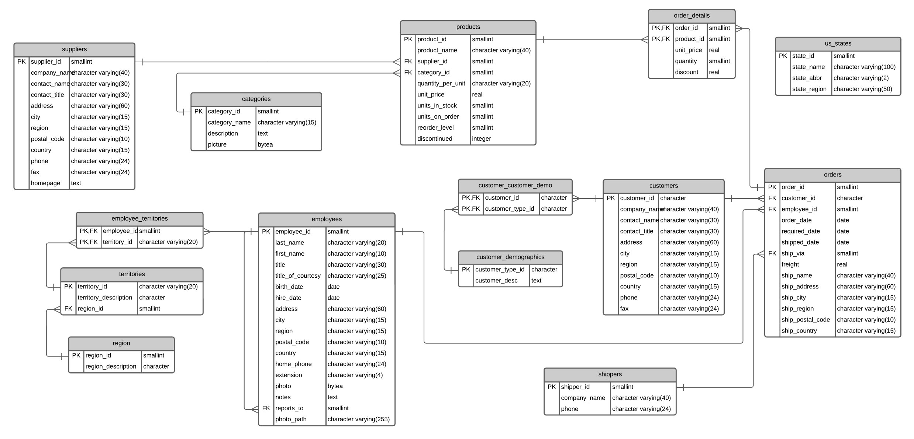

# Northwind Data Lakehouse with Delta Lake 

*Creating a data lakehouse on databricks with community edition.*

## 📖 Project

### 👨🏻‍🏫 Introduction

This project is the creation of a [Data Lakehouse](https://www.databricks.com/glossary/data-lakehouse) - using [Databricks](https://www.databricks.com) and [Delta lake](https://delta.io) technology - for a database containing sales data of a fictitious company called “**Northwind** Traders”, which imports and exports specialty foods around the world. 

The project uses the community version of Databricks, which imposes **restrictions**, such as the use of Delta Live Streams, Cloud Partners Integration, Github Integration and Job Scheduling - the usage of this tools would enrich the project by a lot.

In order to run the project, the following requirements are needed:
- Databricks Runtime 11.0 (community edition)
- Apache Spark 3.3.0
- Scala 2.12

Only structured data was used in the project, but the workspace and project structure - a Data Lakehouse - remains scalable for using semi-structured and unstructured data - depending on the use-case.

### 🎯 Goal

- Create a data lakehouse from the csv files of the database using the following technologies:
  - PySpark
  - Koalas
  - Spark Pandas
  - Hive SQL

- With the Data Lakehouse created, conducting a **business analysis** to answer the following questions:
  - What are the 5 least sold products?
  - What are the top 5 Customers with the highest number of purchases?
  - What are the top 5 Customers with the highest purchases value?
  - Who was the employee who made more sales last year?

### 💽 Database:

## 🗺 Data Lakehouse

## 🗄 Notebooks

- [1.0-bronze-layer.ipynb](notebooks/1.0-bronze-layer.ipynb)
- [2.0-silver-layer.ipynb](notebooks/2.0-silver-layer.ipynb)
- [3.0-gold-layer.ipynb](notebooks/3.0-gold-layer.ipynb)
- [4.0-analysis.ipynb](notebooks/4.0-analysis.ipynb)

## 📦 Folder Structure

    ├── LICENSE
    ├── README.md          <- The top-level README for developers using this project.
    ├── data
    │   ├── processed      <- The final, canonical data sets for modeling.
    │   └── raw            <- The original, immutable data dump.
    │
    ├── notebooks          <- Jupyter notebooks. Naming convention is a number (for ordering),
    │                         and a short `-` delimited description, e.g.
    │                         `1.0-initial-data-exploration`.
    │
    ├── references         <- Figures, manuals, and all other explanatory materials.
