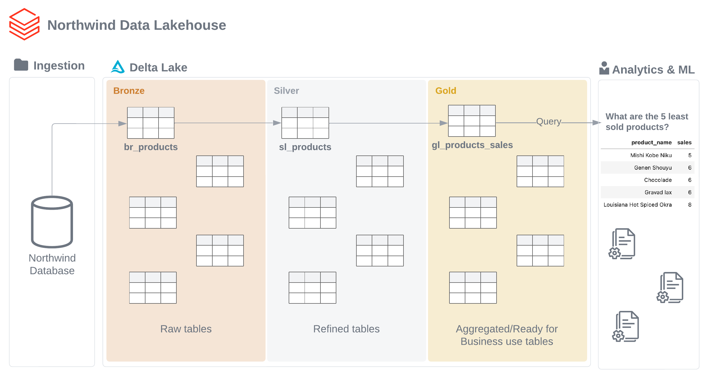

# Northwind Data Lakehouse with Delta Lake 
<div align="center">


</div>

## 🧾 Table of Contents
  - [👨🏻‍🏫 Introduction](#-introduction)
  - [🗺 Project](#-project)
  - [🛠️ Methods](#-Methods)
  - [🗄 Reproducibility](#-reproducibility)
  - [📚 Learnings](#-learnings)
  - [🛣 Roadmap](#-roadmap)

## 👨🏻‍🏫 Introduction

This project is the creation of an elementary [Data Lakehouse](https://www.databricks.com/glossary/data-lakehouse) - using [Databricks](https://www.databricks.com) and the [Delta lake](https://delta.io) technology - for a database containing sales data of a fictitious company called “**Northwind** Traders”, which imports and exports specialty foods around the world. 

With the Data Lakehouse created, a **business analysis** is conducted to answer the following questions:

- What are the 5 least sold products?
- What are the top 5 Customers with the highest number of purchases?
- What are the top 5 Customers with the highest purchases value?
- Who was the employee who made more sales last year?

Northwind Database:


## 🗺 Project



## 🛠️ Methods

**Bronze** layer:

- Python.
- COPY INTO (SQL).

**Silver** layer:

- MERGE INTO (SQL).
- Data types wrangling (SQL).
- Null values wrangling (SQL).

**Gold** layer and **Analysis**:

- PySpark.
- Koalas.
- Spark Pandas.
- Spark/Hive SQL.

## 🗄 Reproducibility

To reproduce the project, follow the steps below:

1. Log into your community version of Databricks.
2. Import the notebooks into your workspace
3. Import the ```.csv``` files from ```/data``` folder into your Databricks DBFS.
4. Start a Cluster following the ```requirements.txt``` file guidance.
5. Customize the DBFS root path of ```1.0-ejk-bronze-layer.ipynb``` in the utilities section according to your specifics.
6. Run all notebooks in their sequence.

## 📚 Learnings

- The project uses the community version of Databricks, which imposes **restrictions**, such as the use of Delta Live Streams, Cloud Partners Integration, Github Integration and Job Scheduling - the usage of this tools would enrich the project by a lot.
- Only structured data was used in the project, but the workspace and project structure - a Data Lakehouse - remains scalable for using semi-structured and unstructured data - just requires the use-case wrangling.

## 🛣 Roadmap

- Transform the Database schema to a Star Schema in the Gold layer.
- Add semi-structured and unstructured data into the Data Lakehouse.